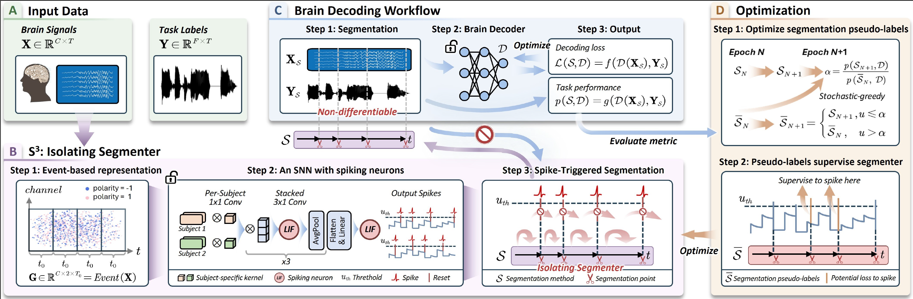
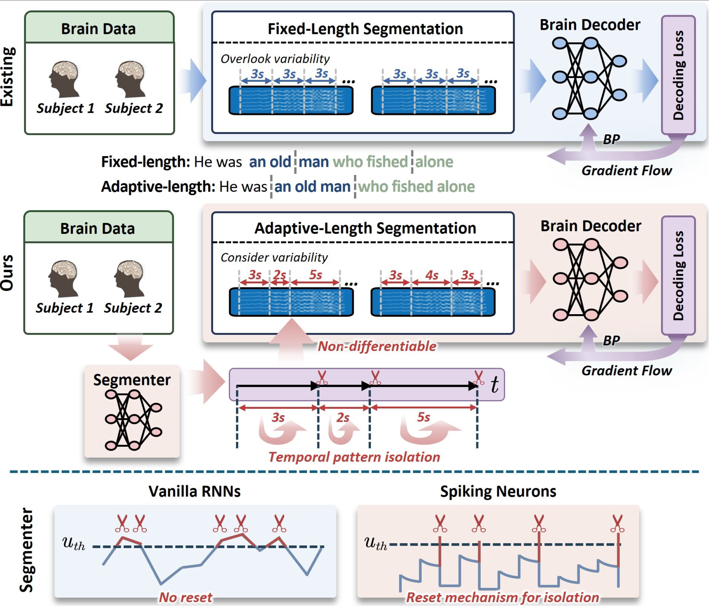

# [AAAI-2026] $\textbf{S}^\textbf{3}$: Spiking Neurons as an Isolating Segmenter for Brain Signal Decoding


## 🚀 Introduction

This repository accompanies the [AAAI-2026 paper](https://openreview.net/forum?id=H1YQhkfqfp).


Here, we leverage **spiking neurons** as an isolating segmenter for brain signal decoding. This segmenter considers subject- and task-level variability, thus providing adaptive segmentation for different brain signals. Most importantly, it exploits the unique **reset mechanism** of spiking neurons to enforce temporal pattern isolation for the generation of each segmentation point.




## 📦 Requirement

Key packages:
- python 3.10
- torch (any >=2.0 version, match your cuda)
- spikingjelly==0.0.0.0.14

You may install the required packages by:
```bash
pip install -r requirements.txt
```


## 🔑 Usage

#### 1. Download data:
All datasets used are public on the internet for easy download.

#### 2. Prepare the brain decoder:
Base weights of [*CBraMod*](https://github.com/wjq-learning/CBraMod) should be loaded for further finetuning.

#### 3. Process the data:
Run scripts in `data_process/`.

#### 4. Run the main script:
```bash
python main.py  # train the SNN and the brain decoder iteratively
python main.py --frozen_ann  # froze the brain decoder, train the SNN only
python main.py --frozen_snn  # froze the SNN, train the brain decoder only
python main.py --eval  # froze both the SNN and the brain decoder, for evaluation
```


## 📄 Citation

If you find this code helpful, we would appreciate it if you cite our paper: